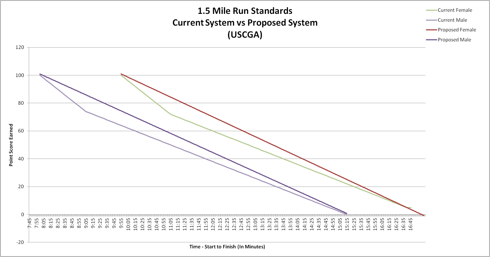

## The Coast Guard Academy PFE

Physical Fitness Exam (PFE) consisting of three parts:


### 1. Pushups


### 2. Situps


### 3. Run

--- .class #id 

## Recent Scoring Changes

The PFE was revamped and we'd like to examine what affect the new system had on scoring.


---

## Observe other trends

-We think that scores dip between 4th Class and 3rd class year, but we don't know why.

-With an interactive Shiny graph, we can examine different years or events to figure out why scores dip.

---

## Example of the Shiny Graph


```{r, echo=FALSE}
require(ggplot2)
All<- read.table("All.csv", header=TRUE, quote="\"")
x<-aggregate(All$NewTotalScore,list(All$ClassYear, All$Class),mean)
x$Group.2<-as.factor(x$Group.2)
t<-ggplot(x,aes(x=Group.1,y=x,colour=Group.2, label=Group.2))
z<-t+geom_point()+geom_text()+labs(title="Total Score",x="Class Year",y="Class Average Score out of 300" )+scale_x_discrete(limits=c("4th Class","3rd Class","2nd Class","1st Class"))
print(z)
```


---

## Anything else to put on that?

Maybe split by Gender?

I'll have Total and Pushups, but allow run or curlups?

Anything else?


