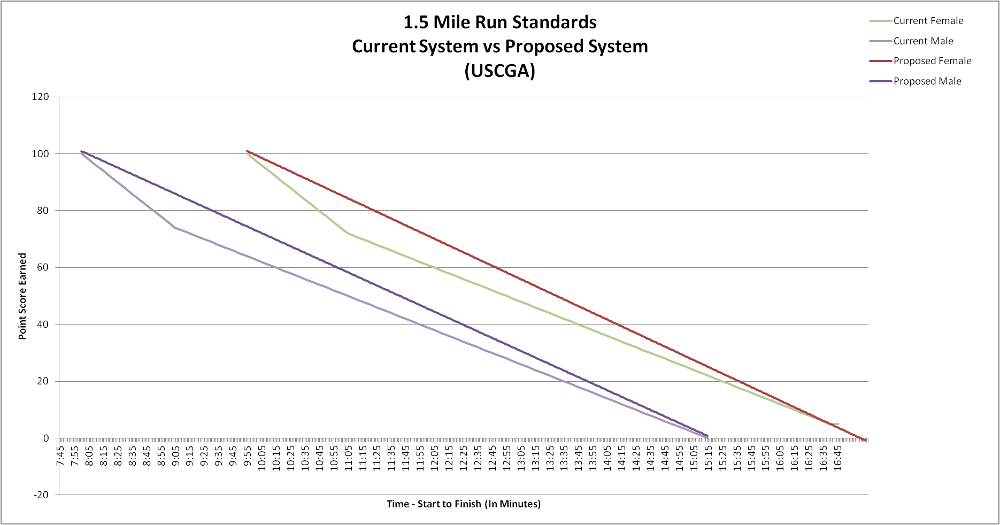
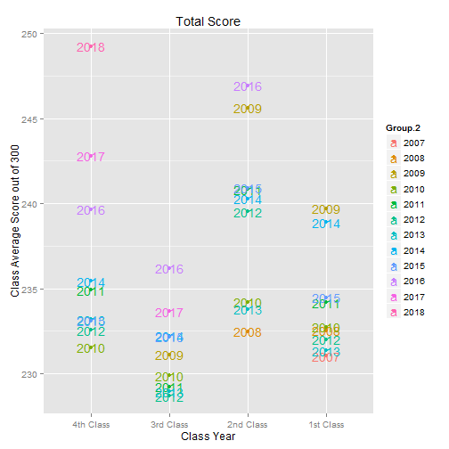

## The Coast Guard Academy PFE

Physical Fitness Exam (PFE) consisting of three parts:

### 1. Pushups

### 2. Situps

### 3. Run

--- .class #id 

## Recent Scoring Changes

The PFE was revamped and we'd like to examine what affect the new system had on scoring.

---

## Observe other trends

-We think that scores dip between 4th Class and 3rd class year, but we don't know why.

-With an interactive Shiny graph, we can examine different years or events to figure out why scores dip.

---

## Example of the Shiny Graph

 

---

## Anything else to put on that?

Maybe split by Gender?

I'll have Total and Pushups, but allow run or curlups?

Anything else?

